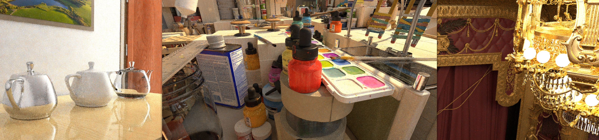

# ReSTIR Path Tracing (ReSTIR PT)

## Introduction
- This repo includes the source code for the following SIGGRAPH 2022 paper

> **Generalized Resampled Importance Sampling: Foundations of ReSTIR** 
> Daqi Lin* (University of Utah), Markus Kettunen* (NVIDIA), Benedikt Bitterli (NVIDIA), Jacopo Pantaleoni (NVIDIA), Cem Yuksel (University of Utah), Chris Wyman (NVIDIA) 
> (*Joint first authors)  
> https://graphics.cs.utah.edu/research/projects/gris/ (with embedded interactive viewer and video)
> https://research.nvidia.com/publication/2022-07_generalized-resampled-importance-sampling-foundations-restir

ReSTIR Path Tracing (ReSTIR PT) is a resampling-based path tracing algorithm as the result of applying the GRIS theory to ReSTIR. Compared to ReSTIR GI \[Ouyang et al. 2021\], ReSTIR PT handles general types of light transport. The path reuse quality is significantly improved by a context-aware shift mapping, allowing interactive rendering of many-bounce diffuse and specular lighting with high quality.

- The method is implemented as a render pass called "ReSTIRPTPass" (Source\RenderPasses\ReSTIRPass) in Falcor 4.4.
See README_Falcor.md for the original README file provided by Falcor.
- A script `RunReSTIRPTDemo.bat` is provided to show how the method works in an animated version of the VeachAjar scene (from [Benedikt Bitterli's rendering resources](https://benedikt-bitterli.me/resources/)) which is contained in the repo.
- Before running the scripts, you need to compile the program and download the scene files following the instruction below.

## Prerequisites
- Windows 10 version 20H2 or newer
- ~~Visual Studio 2019 (If you're using VS2022, make sure to install the VS2019 build tools during setup or modification)~~
- Visual Studio 2022
- [Windows 10 SDK version 10.0.19041.1 Or Newer] (https://developer.microsoft.com/en-us/windows/downloads/sdk-archive)
- NVIDIA driver 466.11 or newer
- RTX 2060 or Higher (NVIDIA graphics card with raytracing support)
- Get NVAPI, head over to https://developer.nvidia.com/nvapi and download the latest version of NVAPI. Create a folder called `.packman` under `Source/Externals`, Extract the content of the zip file into `Source/Externals/.packman/` and rename `Rxxx-developer` to `nvapi`.

## How to compile
- Make sure you have NVAPI in `Source/Externals/.packman/` 
- Open Falcor.sln and Build Solution in configuration ReleaseD3D12

## Run the demo
- execute `RunReSTIRPTDemo.bat`
- The GUI contains self-explanatory settings to turn on/off different components of ReSTIR PT or change its quality.  

## Test with more scenes
- You can test your custom scene by running Bin\x64\Release\Mogwai.exe first, then load a scene file.
- A Falcor pyscene is recommended. For how to create a pyscene, please check out the `Source/RenderPasses/ReSTIRPTPass/Data/VeachAjar/VeachAjar.pyscene` as a template.
Details can be found in Falcor's [documentation](Docs/Usage/Scene-Formats.md)
- Alternatively, if you have a scene file with well defined lighting, material, and camera information that is supported by Falocr (like FBX), you can also create a one-line
pyscene file, e.g. `sceneBuilder.importScene(YOUR_SCENE_FILE)`.

## Offline rendering
- ReSTIR PT is an unbiased algorithm and can be used for offline rendering. The recommended setting is to disable temporal reuse, use 32 candidate samples per pixel, and set the number of spatial reuse rounds, spatial neighbors, and spatial reuse radius to 3, 6, 10, respectively (more details in the paper). 

## An example screenshot (running on an RTX 3090)

